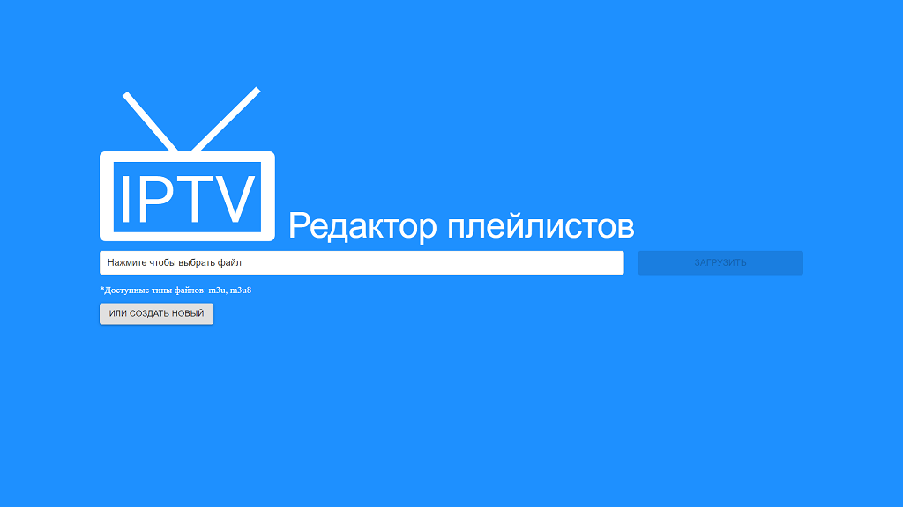
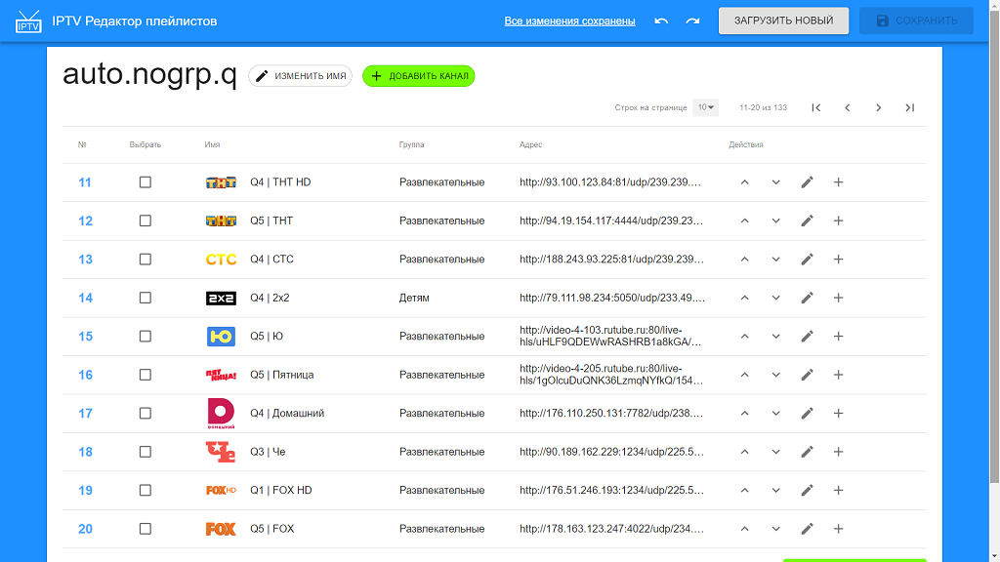

# IPTV channels editor
## Web app for edit .m3u files (list of iptv channels)

Application requires: _.NetCore2.1_, _ffmpeg_, _MongoDB >=4.0.10_


<br/>


### Launching IptvChannelsEditor.Web

#### 1. Build React App
```
cd ClientApp
npm run build
```

#### 2. Set ffmpeg path, mongo connection string in appsettings.json

```
{
...
  "MongoConnectionString": "...",
  "FfmpegPath": "..."
}
```

#### 3. Build Solution

```
cd cs
dotnet build
```

#### 4. Run Web Application
```
dotnet run --launch-profile IptvChannelsEditor.Web.Prod
```